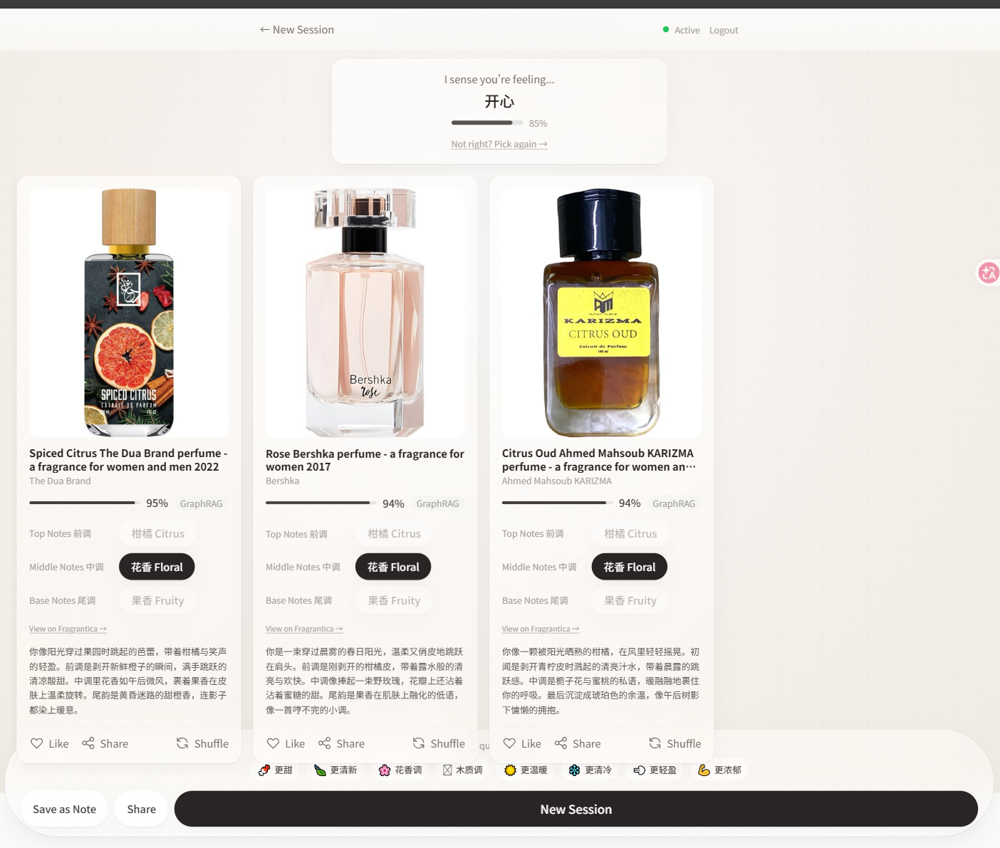

# Emotion × Personality × Fragrance AI Agent

[中文](README.md)

> Understand your emotions through scent 🌿

**Emotion × Personality × Fragrance AI Agent** is an intelligent fragrance recommendation web app for C-end users. Powered by LLM as its core reasoning engine, combined with GraphRAG graph-structured reasoning, sentiment analysis, and a three-layer hierarchical memory architecture, it matches users' emotional states, personality traits, and usage contexts with a fragrance knowledge graph to generate personalized fragrance recommendations with narrative copy — delivering "emotion-driven perfume discovery."

---

## Positioning

| Dimension | Description |
|-----------|-------------|
| **Core Value** | No fragrance terminology needed — talk about your mood or pick a card, and AI finds your signature scent |
| **Target Users** | C-end consumers (shopping for themselves / gifting for others) |
| **Platform** | Web-first (responsive desktop + mobile), App extension reserved |
| **Current Phase** | MVP Phase 1 — Recommendation experience loop (Complete ✅) |

### MVP Phase 1 Completion Status

| Metric | Value |
|--------|:---:|
| FR Coverage | **16/20 (80%)** / incl. partial **19/20 (95%)** |
| Backend Tests | **70 passed**, 0 failed |
| Frontend Tests | **20 passed** |
| TypeScript | **Zero errors** |
| SSE Events | **28 defined / 14 emitted** |
| Perf Benchmarks | **8/8 passed** |
| Neo4j Knowledge Graph | **1,179 fragrances / 70 accords / 74 emotion→accord edges** |
| Accord Diversity | **3 recommendations from different accord clusters** (citrus/floral/woody/spicy…) |
| Perfume Images | **Fragrantica real images** (`primaryImageUrl`, with picsum fallback) |

> The 4 remaining FRs (FR-1.1~1.3, FR-1.6) are scoped for Phase 2 user profiling.

### C-End Design Principles

| Principle | Description |
|-----------|-------------|
| **Low Barrier** | Guest mode, emotion cards, scene-based guidance — no fragrance jargon required |
| **Low Latency** | Full-link parallelization, preloading, skeleton streaming — first-byte-first |
| **Low Friction** | Implicit feedback, option-based follow-ups, async tail processing |
| **Feeling Heard** | Emotion confirmation micro-interactions, refinement dialogue, proactive check-ins |
| **In Control** | Memory transparency, safety profile management, manual intent switching |
| **Safety** | Local sensitive-word filter, crisis-differentiated response, data deletion rights |
| **Context-Aware** | Auto-detection of self-use / gifting / exploration intents with differentiated strategies |
| **Replayable** | Full session persistence, history browsing, emotional timeline |

---

## Role Classification

The system defines **five roles** spanning C-end consumers, B-end perfumers, and system operations:

```
                    ┌──────────────────┐
                    │  Administrator   │
                    │   (Admin/Ops)    │
                    └────────┬─────────┘
                             │ Monitor, rate-limit, secure
                             │
    ┌────────────────────────┼────────────────────────┐
    │                        │                        │
    ▼                        ▼                        ▼
┌──────────┐          ┌──────────┐            ┌──────────┐
│  Guest   │  Sign up │   Free   │   Upgrade  │ Premium  │
│          │ ───────→ │   User   │ ─────────→ │   User   │
└────┬─────┘          └────┬─────┘            └────┬─────┘
     │                     │                       │
     │ ① One-shot trial   │ ② Daily use           │ ③ Heavy use
     │ Self-use only      │ All intents + quotas   │ Unlimited + priority
     │                     │                       │
     └─────────────────────┼───────────────────────┘
                           │
                           │ Request physical card
                           ▼
                    ┌──────────┐
                    │ Perfumer │
                    │          │
                    └──────────┘
                     ④ Receive brief → blend → deliver physical fragrance card
```

---

## Role Details

### ① Guest

> **Positioning:** Zero-barrier trial — complete one full recommendation loop without registration.

| Capability | Description |
|------------|-------------|
| 🎭 **Emotion Input** | Emotion card picker (8 preset cards), optional text supplement |
| 🧠 **Intent Support** | Self-use (`self_use`) only |
| 💬 **Recommendation** | 1 complete session (emotion recognition → fragrance matching → skeleton generation → streaming copy) |
| 🔄 **Refinement** | 8 refinement chips (Sweeter/Fresher/Woody…) + 18-rule engine to adjust emotion vectors & re-recommend |
| 🛡️ **Safety Net** | Crisis keyword detection → CrisisOverlay full-screen overlay + helplines; human handoff detection → notification + contact email |
| ⚠️ **Allergen Mgmt** | SettingsPage allergen input → backend matches note names → FragranceCard red warning badges |
| 🔍 **Confirmation Gate** | Confidence < 85% triggers follow-up UI: "Is this accurate?" → Confirm / Rephrase |
| 📝 **Note Card** | Real-time inspiration notes during session, PNG export supported |
| 🔗 **Share** | Generate shareable link for recommendation results |
| ⏰ **Data Retention** | Guest conversations stored in temp table; auto-deleted after 30 days of no registration |
| 🔐 **Upgrade Path** | Guest data auto-migrated to permanent account upon registration |
| ⚠️ **Limitations** | No gift/explore modes, no persistent profile, no history saved |

**Typical Journey:** Visit landing → Click "✨ Try Free" → Pick emotion cards (or write how you feel) → View recommendations → Share or take notes → Session ends

---

### ② Free User

> **Positioning:** Daily-use tier for registered users, covering most recommendation needs.

| Capability | Description |
|------------|-------------|
| 🎭 **Emotion Input** | Dual-channel: emotion cards + free-text description (LLM synesthesia decoding) |
| 🧠 **Intent Support** | All three modes: self-use / gifting / exploration |
| 💬 **Sessions** | 10 sessions/day |
| 🎯 **Generations** | 15/day (fast + deep combined) |
| 🧬 **Deep Mode** | 3/day (Supervisor → 3 Subagent multi-angle parallel reasoning) |
| 🔄 **Refinement** | Unlimited (8 refinement chips + 18-rule engine) |
| 🛡️ **Safety Net** | Crisis detection + CrisisOverlay helpline overlay + human handoff detection |
| ⚠️ **Allergens** | Custom allergen list; recommendations auto-matched with red badge warnings |
| 📊 **History** | Last 30 days of conversation history |
| 👤 **User Profile** | Progressive profiling (lightweight for first 3 sessions, full reasoning from session 4) |
| 🃏 **Card Production** | 1/month (submit formula → perfumer collaboration → physical fragrance card) |
| 🔗 **Share** | Share link generation |
| 📝 **Note Card** | Full-featured note system |
| 🛡️ **Safety Profile** | Allergen / disliked notes recording; active in self-use mode only |
| 📈 **Quota Alerts** | Subtle reminder at 80% usage (e.g., "X generations remaining today") |

**Typical Journey:** Register/Login → Cold-start onboarding (≤ 3 questions) → Enter chat → Select intent → Dialogue → Refine → Browse history / Manage memory

---

### ③ Premium User

> **Positioning:** Unlimited tier for heavy users — unlocks all capabilities with priority service.

**Includes all Free User features, plus:**

| Enhanced Capability | Description |
|---------------------|-------------|
| ♾️ **Sessions** | Unlimited |
| ♾️ **Generations** | Unlimited |
| ♾️ **Deep Mode** | Unlimited (multi-angle parallel reasoning available for all scenarios) |
| ⚡ **Priority** | Priority LLM queue during peak hours |
| 📊 **History** | Full history, no time limit |
| 🃏 **Card Production** | 3 physical fragrance cards/month |
| 🔮 **Early Access** | Priority access to new feature rollouts |
| 🎯 **Advanced Profile** | Complete five-dimensional personality modeling (Memory / Emotion / Identity / Social / Personality) |

---

### ④ Perfumer

> **Positioning:** B-end collaborator — transforms AI-generated formulas into physical fragrance cards.

| Capability | Description |
|------------|-------------|
| 📋 **Collaboration Queue** | Receive formula production requests from users |
| 🔍 **Formula Review** | View AI-generated note combinations and recommendation rationale |
| 📦 **Status Management** | Update production progress (Queued → Blending → Complete) |
| 💬 **Feedback Channel** | Provide feedback on formula feasibility and system interaction |
| 🎨 **Creative Input** | Manual perfumery creation based on AI skeleton |

> MVP provides minimal notification mechanism (queue write + status query). The full B-end Perfumer Collaboration Platform will be delivered in a later phase.

---

### ⑤ Administrator (Admin/Ops)

> **Positioning:** Ensures system stability, security compliance, and data quality.

| Capability | Description |
|------------|-------------|
| 🖥️ **Service Monitoring** | Health checks, latency monitoring, error rate alerts |
| 🔒 **Security** | Crisis keyword library maintenance, rate-limit policy configuration, JWT key management |
| 📊 **Quota Management** | User quota policy configuration and adjustment |
| 🗄️ **Data Operations** | Database migrations (Alembic), guest data expiration cleanup (30-day TTL) |
| 📈 **Quality Analytics** | LLM call success rates, BERT confidence distributions, user feedback aggregation |
| 🔑 **LLM Key Config** | Manage LLM API keys via admin API (Redis hot storage) |
| 📦 **Knowledge Graph** | Neo4j fragrance graph data import and maintenance |

---

## Technical Architecture

```
┌─────────────────────────────────────────────────────┐
│             Frontend (React 18 + Vite + Tailwind)    │
│  LandingPage / GuestChatPage / AuthChatPage / SharePage │
│  EmotionCardPicker / FragranceCard / NoteCard / CrisisOverlay │
│  RefinementChips / EmotionConfirmation / SceneTagChips   │
│              Zustand Stores / SSE Client               │
└────────────────────────┬────────────────────────────┘
                         │ SSE Streaming + REST
┌────────────────────────▼────────────────────────────┐
│            Backend (Python FastAPI :8000)             │
│                                                       │
│  /api/v1/guest/sessions      (Guest SSE recommend)   │
│  /api/v1/recommend/sessions  (Auth SSE recommend)    │
│  /api/v1/auth/*              (Register/Login/Refresh) │
│  /api/v1/share/*             (Share links)           │
│  /api/v1/config/llm-key      (LLM Key management)    │
│  /api/v1/memory/*            (Memory queries)        │
│                                                       │
│  Services: emotion / fragrance / generation / safety / refinement │
│           memory / recall                              │
│  Middleware: CORS / Trace-Id / RateLimit / Quota       │
└──┬──────────────┬──────────────┬────────────────────┘
   │              │              │
   ▼              ▼              ▼
┌──────┐   ┌──────────┐   ┌─────────┐
│PostgreSQL│ │  Redis 7 │   │Neo4j 2025│
│ pg15    │ │  Cache + │   │  Graph   │
│+pgvector│ │ RateLimit │   │ GraphRAG │
└──────┘   └──────────┘   └─────────┘

Recommendation Pipeline:
  emotion_vector (8-dim, all emotions participate)
    → 74 SOOTHES edges × scene boost (+0.25)
    → GraphRAG scoring (limit=50)
    → Accord-cluster greedy diversity (_diverse_top3)
    → 3 recommendations (from different accord clusters)
```

| Layer | Technology | Notes |
|-------|-----------|-------|
| Frontend | React 18 + Vite + Tailwind CSS + Zustand | SSE streaming rendering, glass morphism UI |
| Backend | Python FastAPI | Async SSE generator, 7-domain 22+ event protocol |
| Graph DB | Neo4j 2025 | Fragrance knowledge graph (accords → perfumes), 1-hop GraphRAG, 74 emotion→accord edges, scene-weighted scoring |
| Relational DB | PostgreSQL 15 + pgvector | User/session/memory persistence, 512-dim vector semantic search |
| Cache | Redis 7 | Layer 1 session memory (1+5 sliding window), rate limiting, LLM Key hot storage |
| LLM | DeepSeek / Claude | 9-call constraint matrix, dual-path (BERT fast path + LLM fallback) |
| Deployment | Docker Compose | One-command infrastructure startup |

---

## Quick Start

### Prerequisites

- Docker Desktop (or Podman)
- Python 3.11+
- Node.js 20+
- Poetry (Python package manager)

### 1. Start Infrastructure

```bash
docker compose -f docker/docker-compose.yml up -d
```

Launches PostgreSQL 15 (pgvector) + Redis 7 + Neo4j 2025, all bound to `127.0.0.1`.

> **Windows users:** If port 7687 fails with `bind: An attempt was made to access a socket in a way forbidden by its access permissions`, this is due to Windows port reservation. The `docker-compose.yml` maps Neo4j Bolt to `17687` (avoiding the 7681-7780 reserved range). Set `NEO4J_URI=bolt://localhost:17687` in `.env`. Restarting Docker Desktop usually restores port 7687.

### 2. Initialize Knowledge Graph

```bash
# First-time import: convert Fragrantica data to Neo4j Cypher
python scripts/import_fragrantica_to_neo4j.py

# Data migrations (update existing Neo4j)
python scripts/migrate_add_image_to_neo4j.py        # Add perfume images
python scripts/migrate_expand_emotion_accords.py    # Expand emotion→accord edges (22→74)
```

### 3. Start Backend

```bash
cd backend
cp .env.example .env   # Edit .env and add your LLM API Key
poetry install
poetry run alembic upgrade head    # Run database migrations
python -m uvicorn app.main:app --reload --port 8000
```

### 4. Start Frontend

```bash
npm ci
cd packages/frontend
npx vite   # Open http://localhost:5173
```

### 5. Run Tests

```bash
# Backend tests (70 tests: Auth/Memory/Quota/Share/Config)
cd backend && poetry run pytest tests/ -v

# Skip E2E tests (no Docker needed)
cd backend && poetry run pytest tests/ -v -m "not e2e"

# Frontend type-check
cd packages/frontend && npx tsc --noEmit

# Frontend component tests (20 tests)
cd packages/frontend && npx vitest run

# E2E browser tests (requires Docker services running)
cd packages/frontend && npx playwright test
```

---

## Project Structure

```
perfume_web/
├── backend/                        # Python FastAPI backend
│   ├── app/
│   │   ├── api/v1/                 # REST + SSE endpoints
│   │   ├── core/                   # Config, DI, Auth, Rate Limiting
│   │   ├── graph/                  # Neo4j async client
│   │   ├── models/                 # Pydantic models
│   │   ├── services/               # Business logic (emotion/fragrance/copy/safety/refinement/memory)
│   │   ├── sse/                    # SSE protocol & event stream generator
│   │   └── main.py                 # FastAPI app entry point
│   └── tests/                      # pytest suite
├── packages/
│   ├── shared/                     # Shared TypeScript type definitions
│   └── frontend/                   # React + Vite + Tailwind frontend
│       └── src/
│           ├── routes/             # Page route components
│           ├── components/         # UI components (FragranceCard / CrisisOverlay / RefinementChips / EmotionConfirmation etc.)
│           ├── hooks/              # Custom hooks (useSSE)
│           ├── stores/             # Zustand state management
│           └── lib/                # SSE client wrapper
├── docker/                         # Docker Compose config + Neo4j init scripts
├── docs/                           # Requirements & design specs
│   └── superpowers/specs/          # PRD / TRD / Wireframe / Quality / Design Docs
└── scripts/                        # Data import & migration scripts
    ├── import_fragrantica_to_neo4j.py     # Dataset → Cypher converter
    ├── migrate_add_image_to_neo4j.py      # Add real perfume images
    └── migrate_expand_emotion_accords.py  # Expand emotion→accord edges
```

---

## Reference Documents

| Document | Description |
|----------|-------------|
| [Product Requirements (PRD)](docs/superpowers/specs/2026-06-19-A-产品需求文档.md) | 35 FRs, user roles, MVP phase plan |
| [Technical Requirements (TRD)](docs/superpowers/specs/2026-06-19-B-技术需求文档.md) | 18 APIs + 22+ SSE events, LLM architecture, database design |
| [Wireframes](docs/superpowers/specs/2026-06-19-C-线框图.md) | 16 routes + 32 components, SSE interaction timeline |
| [Quality Standards](docs/superpowers/specs/2026-06-19-D-质量准则.md) | 18 performance metrics, 4-layer security, 13 risk items |
| [Business Flow Design](docs/superpowers/specs/2026-06-19-业务流设计.md) | Full-link journeys, cross-module data flow, user tier quotas |
| [Recommendation Diversity Design](docs/superpowers/specs/2026-06-23-推荐多样化-design.md) | 74 SOOTHES edges + scene score + accord-cluster diversity algorithm |

---

## License

Private — All rights reserved.
